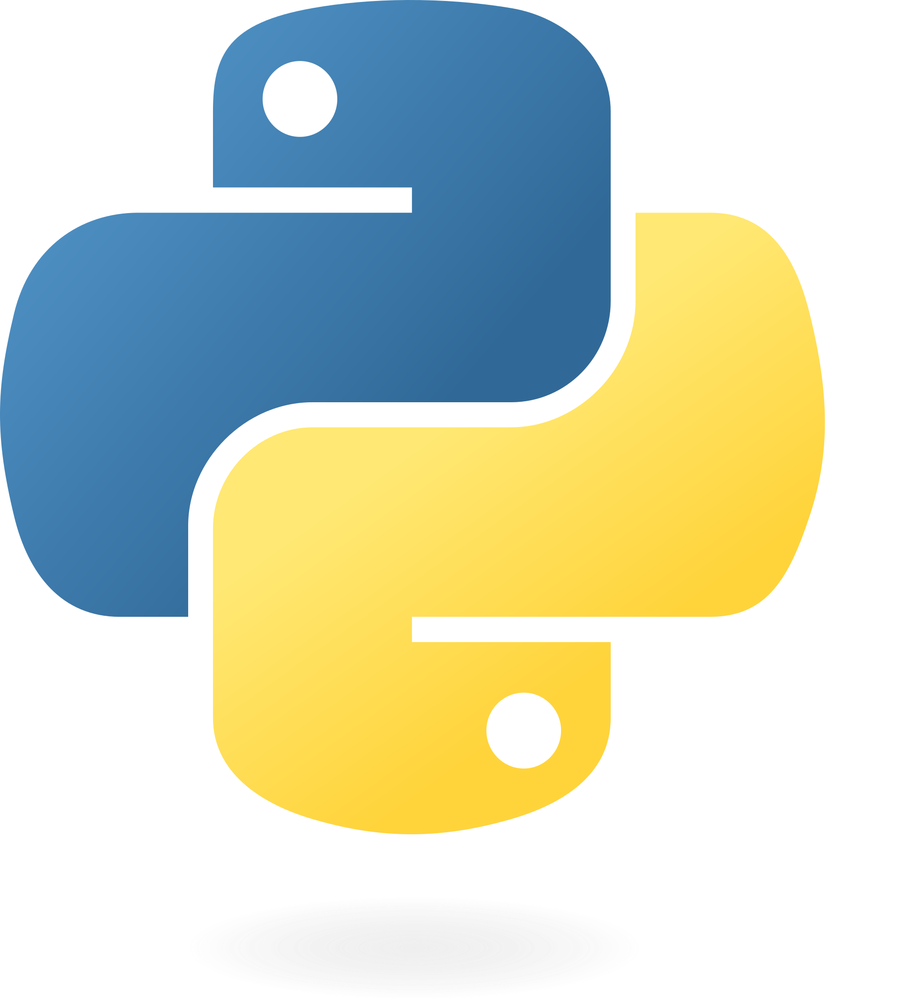
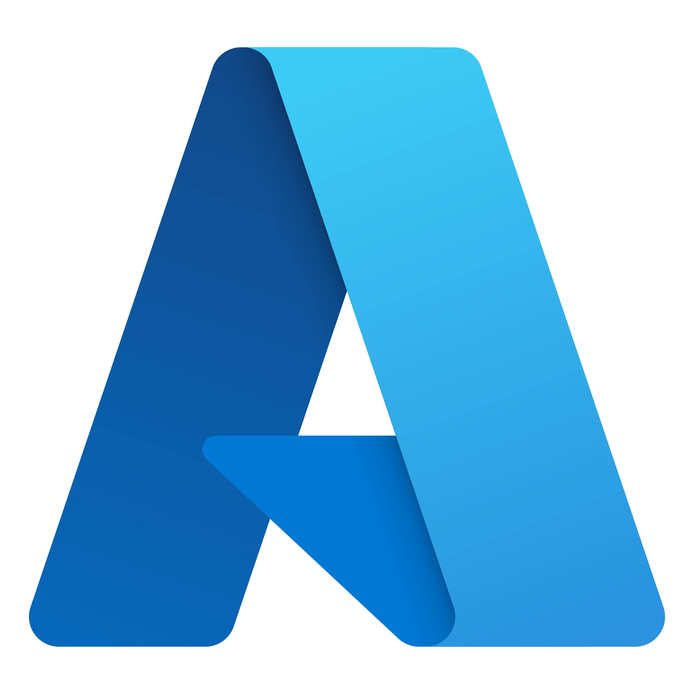
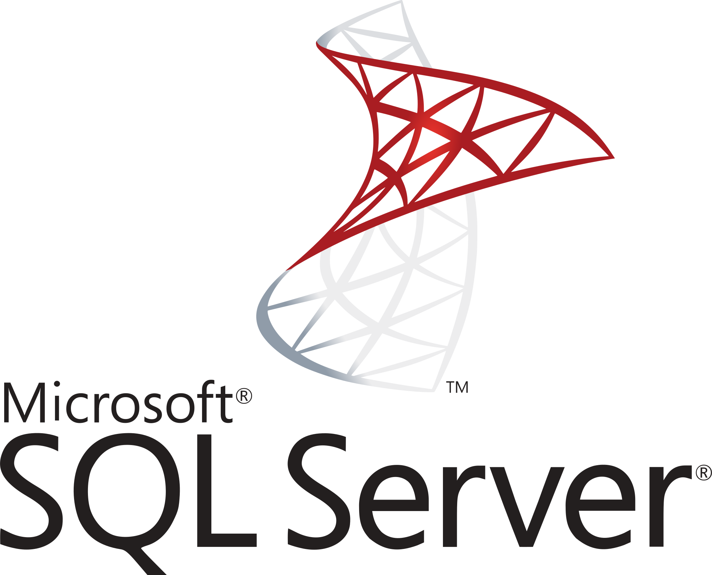

## Hi there 👋

## 🛠️ Languages & Tools I've Worked With

### Data Engineering & Analytics:
-  **Python**
-  **SQL**
-  **Power BI**
-  **Power Apps**
-  **Azure**
-  **SQL Server**

### Creative Design:
-  **Photoshop**
-  **Illustrator**
-  **Adobe After Effects**
-  **Premiere Pro**
-  **Adobe InDesign**

---

---

## 📫 How to Reach Me
Feel free to contact me for any queries or opportunities:

- 📧 Email: [emylyafalcao@gmail.com](mailto:emylyafalcao@gmail.com)
- 💼 LinkedIn: [linkedin.com/emylyfalcao](https://linkedin.com/emylyfalcao)

---

Thank you for visiting my GitHub profile! 😊
